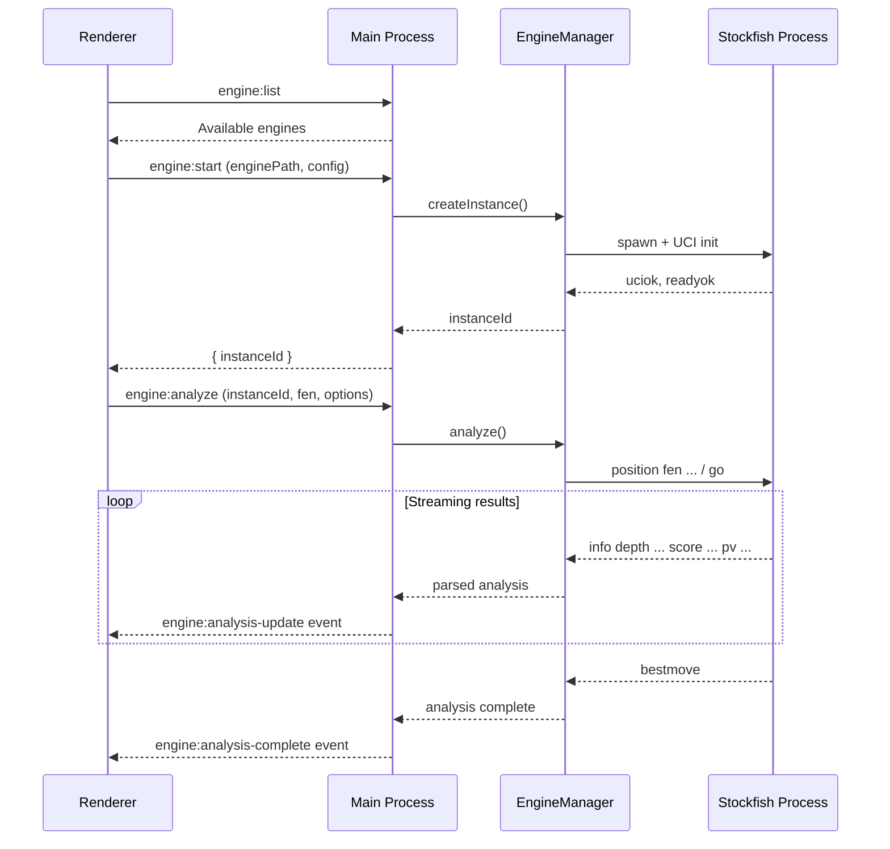

# Chess Engine API Plan

## Overview

Add a new `engine` API domain to the existing IPC infrastructure, enabling the renderer to discover, control, and receive analysis from UCI-compatible chess engines (e.g., Stockfish, Leela Chess Zero).

## Architecture



## API Endpoints

### 1. `engine:list` - Discover Available Engines

Returns list of UCI engines available on the system.

**Request:**

```typescript
interface EngineListRequest {
  // empty - no params needed
}
```

**Response:**

```typescript
interface EngineInfo {
  id: string           // unique identifier (e.g., 'stockfish-17')
  name: string         // display name
  path: string         // executable path
  version?: string     // detected version
  isInstalled: boolean // whether binary exists
}

interface EngineListResponse {
  engines: EngineInfo[]
}
```

**Implementation notes:**

- Check common install paths + user-configured paths
- Probe each engine binary with `uci` command to get name/version
- Cache results, refresh on demand

---

### 2. `engine:start` - Start an Engine Instance

Spawns an engine process and initializes UCI protocol. Required for multi-engine scenarios.

**Request:**

```typescript
interface EngineStartRequest {
  engineId: string     // from engine:list
  options?: {
    threads?: number   // default: auto-detect cores
    hash?: number      // MB, default: 256
    multiPV?: number   // lines to analyze, default: 1
  }
}
```

**Response:**

```typescript
interface EngineStartResponse {
  instanceId: string   // UUID to identify this running instance
  name: string         // engine name from UCI
  author: string       // engine author from UCI
}
```

**Implementation notes:**

- Spawn child process with stdio pipes
- Send `uci`, wait for `uciok`
- Send `setoption` commands for config
- Send `isready`, wait for `readyok`
- Store instance in `EngineManager` map

---

### 3. `engine:stop` - Stop an Engine Instance

Terminates an engine process and cleans up resources.

**Request:**

```typescript
interface EngineStopRequest {
  instanceId: string
}
```

**Response:**

```typescript
interface EngineStopResponse {
  success: boolean
}
```

**Implementation notes:**

- Send `quit` command first (graceful)
- Kill process if no response after timeout
- Remove from `EngineManager` map

---

### 4. `engine:status` - Get Engine Status

Check the current state of an engine instance.

**Request:**

```typescript
interface EngineStatusRequest {
  instanceId?: string  // specific instance, or omit for all
}
```

**Response:**

```typescript
type EngineState = 'idle' | 'analyzing' | 'stopping' | 'error'

interface EngineInstanceStatus {
  instanceId: string
  engineId: string
  state: EngineState
  currentFen?: string  // position being analyzed
  uptime: number       // ms since started
  options: Record<string, string | number | boolean>
}

interface EngineStatusResponse {
  instances: EngineInstanceStatus[]
}
```

---

### 5. `engine:analyze` - Analyze a Position

Start analysis on a position. Streams results via events.

**Request:**

```typescript
interface EngineAnalyzeRequest {
  instanceId?: string  // omit to auto-start default engine
  fen: string          // position to analyze
  moves?: string[]     // moves from position (for startpos + moves)
  options?: {
    depth?: number     // max depth (omit for infinite)
    time?: number      // max time in ms
    nodes?: number     // max nodes
    multiPV?: number   // override instance multiPV
  }
}
```

**Response:**

```typescript
interface EngineAnalyzeResponse {
  instanceId: string   // the instance analyzing (useful if auto-started)
  analysisId: string   // unique ID for this analysis session
}
```

**Streamed events:** `engine:analysis-update`

```typescript
interface AnalysisUpdate {
  analysisId: string
  instanceId: string
  depth: number
  seldepth: number
  score: {
    type: 'cp' | 'mate'
    value: number      // centipawns or moves to mate
  }
  nodes: number
  nps: number          // nodes per second
  time: number         // ms elapsed
  pv: string[]         // principal variation (moves)
  multipv?: number     // which line (1-indexed) if multiPV > 1
}
```

**Completion event:** `engine:analysis-complete`

```typescript
interface AnalysisComplete {
  analysisId: string
  instanceId: string
  bestmove: string
  ponder?: string
}
```

**Implementation notes:**

- Parse UCI `info` lines into structured data
- Emit events via `webContents.send()`
- Auto-start behavior: if no `instanceId` and no running instances, start default engine first

---

### 6. `engine:stop-analysis` - Stop Current Analysis

Stops analysis without terminating the engine (engine stays warm).

**Request:**

```typescript
interface EngineStopAnalysisRequest {
  instanceId: string
}
```

**Response:**

```typescript
interface EngineStopAnalysisResponse {
  success: boolean
  bestmove?: string    // last best move if available
}
```

**Implementation notes:**

- Send `stop` UCI command
- Engine responds with `bestmove`

---

### 7. `engine:configure` - Update Engine Options

Change UCI options on a running engine.

**Request:**

```typescript
interface EngineConfigureRequest {
  instanceId: string
  options: {
    threads?: number
    hash?: number
    multiPV?: number
    // other UCI options by name
    [key: string]: string | number | boolean | undefined
  }
}
```

**Response:**

```typescript
interface EngineConfigureResponse {
  success: boolean
}
```

**Implementation notes:**

- Must stop any active analysis first
- Send `setoption name X value Y` for each option
- Send `isready` and wait for `readyok` to confirm

---

## File Structure

```
src/
├── api/
│   └── engine/
│       ├── index.ts              # Register all handlers
│       ├── EngineListHandler.ts
│       ├── EngineStartHandler.ts
│       ├── EngineStopHandler.ts
│       ├── EngineStatusHandler.ts
│       ├── EngineAnalyzeHandler.ts
│       ├── EngineStopAnalysisHandler.ts
│       └── EngineConfigureHandler.ts
├── engine/
│   ├── EngineManager.ts          # Singleton managing all instances
│   ├── EngineInstance.ts         # Single engine process wrapper
│   ├── UciParser.ts              # Parse UCI protocol output
│   └── types.ts                  # Shared types
└── renderer/
    └── analysis/
        └── composables/
            └── useChessEngine.ts # Renderer-side composable
```

---

## Key Implementation Details

### EngineManager (Singleton)

- Maintains `Map<instanceId, EngineInstance>`
- Handles auto-cleanup on app quit
- Provides methods: `createInstance()`, `getInstance()`, `destroyInstance()`, `getAllInstances()`

### EngineInstance (Class)

- Wraps `child_process.spawn()`
- Manages UCI state machine (uninitialized -> ready -> analyzing -> idle)
- Parses stdout line-by-line with `UciParser`
- Emits events to main process for forwarding to renderer

### UCI Parser

Parse common UCI output:

- `id name X` / `id author X`
- `uciok` / `readyok`
- `info depth X seldepth X score cp X nodes X nps X time X pv X`
- `bestmove X ponder Y`

---

## Considerations

1. **Engine binaries**: Need a strategy for bundling or detecting system-installed engines
2. **Error handling**: Engine crashes, invalid FEN, timeout scenarios
3. **Memory limits**: Cap number of simultaneous instances
4. **Cleanup**: Ensure all engines terminate on app close (`app.on('before-quit')`)